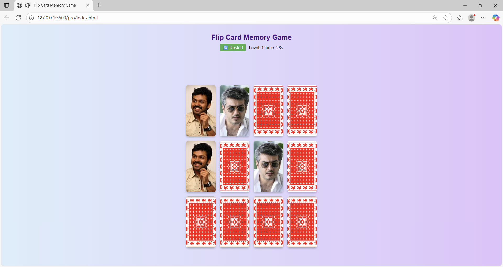

# FlipFusion 🎴 - Flip Card Memory Game

FlipFusion is an interactive **Flip Card Memory Game** built using
**HTML, CSS, and JavaScript**.\
The objective is simple: *Match. Remember. Win.*

------------------------------------------------------------------------

## 🚀 Features

-   🎨 Beautiful UI with animated card flip effect
-   🔊 Background music and sound effects (flip, match, mismatch, win,
    fail)
-   ⏱ Countdown timer for each level
-   🔄 Restart button to reset the game anytime
-   🏆 Multiple levels with increasing difficulty

------------------------------------------------------------------------

## 🛠️ Technologies Used

-   **HTML5** - Structure of the game
-   **CSS3** - Styling, animations, and responsive layout
-   **JavaScript (Vanilla JS)** - Game logic and interactivity
-   **Audio** - Sound effects and background music

------------------------------------------------------------------------

## 📂 Project Structure

    FlipFusion/
    ┣ 📜 index.html   # Main game UI
    ┣ 📜 style.css    # Styling & animations
    ┣ 📜 script.js    # Game logic (flip, match, timer, sounds)
    ┣ 🎨 card-back.png # Card back design
    ┣ image.png
    ┣ 🎵 sounds/       # Game sounds (flip, match, win, fail, background)

------------------------------------------------------------------------

## 🎮 How to Play

1.  Open **index.html** in your browser.
2.  Click on the cards to flip them.
3.  Match two identical cards to score.
4.  Complete all matches before time runs out.
5.  Advance to the next level and test your memory!

------------------------------------------------------------------------

## 📷 Screenshot

------------------------------------------------------------------------

## 📌 Future Enhancements

-   🔢 Add difficulty levels with different grid sizes (4x4, 6x6, etc.)
-   🏅 Add scoring system & leaderboard
-   📱 Improve mobile responsiveness
-   🎨 Add custom card themes

------------------------------------------------------------------------

## 👨‍💻 Author

Developed with ❤️ by **Kiruba S**
